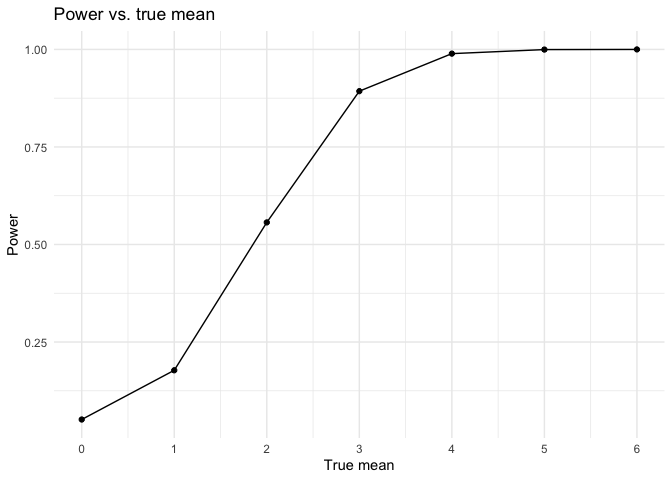

p8105_hw5_qh2284
================
Qin Huang
2023-11-03

## Problem 1

**Describe the raw data. Create a `city_state` variable
(e.g. “Baltimore, MD”) and then summarize within cities to obtain the
total number of homicides and the number of unsolved homicides (those
for which the disposition is “Closed without arrest” or “Open/No
arrest”).**

``` r
# load the data
homi = read.csv("./data/homicide-data.csv")
```

The raw data contains 52179 observations and 12 variables.The dataset
contains the id to represent the events, reported_date shows when the
events occurred (but this column need to be modified later since it’s
not readable). It contains the victims’ last name, first name, age,
race, sex. And it contains where the events happened (city, state,
latitude, longitude) and the status of the events. We also could
observed that there are some missing values in `lat` and `lon` columns
which means we lack of these infos. Also, we found there exists
“unknown” in `victim_age`, `victim_sex`, `victim_race`, `victim_last`,
`victim_first` to represent missing infos.

``` r
# create new variable
homi_new = homi %>%
  mutate(city_state = paste0(city,', ',state))

homi_summary = homi_new %>%
  group_by(city_state) %>%
  summarise(
    total_homicides = n(),
    unsolved_homicides = sum(disposition %in% c("Closed without arrest", "Open/No arrest"))
  )

homi_summary
```

    ## # A tibble: 51 × 3
    ##    city_state      total_homicides unsolved_homicides
    ##    <chr>                     <int>              <int>
    ##  1 Albuquerque, NM             378                146
    ##  2 Atlanta, GA                 973                373
    ##  3 Baltimore, MD              2827               1825
    ##  4 Baton Rouge, LA             424                196
    ##  5 Birmingham, AL              800                347
    ##  6 Boston, MA                  614                310
    ##  7 Buffalo, NY                 521                319
    ##  8 Charlotte, NC               687                206
    ##  9 Chicago, IL                5535               4073
    ## 10 Cincinnati, OH              694                309
    ## # ℹ 41 more rows

**For the city of Baltimore, MD, use the `prop.test` function to
estimate the proportion of homicides that are unsolved; save the output
of `prop.test` as an R object, apply the `broom::tidy` to this object
and pull the estimated proportion and confidence intervals from the
resulting tidy dataframe.**

``` r
library(broom)

bal = homi_summary %>%
  filter(city_state == "Baltimore, MD")

# Calculate the proportion of unsolved homicides
res = prop.test(pull(bal,unsolved_homicides), pull(bal,total_homicides),
          alternative = "two.sided",
          conf.level = 0.95, correct = TRUE) 
res_tidy = broom::tidy(res)

# the result is save in the result folder in the R project
save(res_tidy, file = "result/res_tidy_baltimore.RData")

# pull the estimated proportion and confidence intervals
est_prop = pull(res_tidy, estimate[1])
ci = paste0("(", pull(res_tidy, conf.low),",", pull(res_tidy, conf.high),")")

tidy_frame = data.frame(
  city = 'Baltimore, MD',
  estimate_prop = as.numeric(est_prop),
  ci_low = pull(res_tidy, conf.low),
  ci_high = pull(res_tidy, conf.high),
  confidenct_interval = ci
) 

print(tidy_frame)
```

    ##            city estimate_prop    ci_low   ci_high
    ## 1 Baltimore, MD     0.6455607 0.6275625 0.6631599
    ##                     confidenct_interval
    ## 1 (0.627562457662644,0.663159860401662)

**Now run `prop.test` for each of the cities in your dataset, and
extract both the proportion of unsolved homicides and the confidence
intervasl for each. Do this within a “tidy” pipeline, making use of
`purrr::map`, `purrr::map2`, list columns and `unnest` as necessary to
create a tidy dataframe with estimated proportions and CIs for each
city.**

``` r
# run for each city
library(purrr)

# Define the loop_ci function
loop_ci = function(cs) {
  city = homi_summary %>%
    filter(city_state == cs)
  
  res = prop.test(pull(city, unsolved_homicides), pull(city, total_homicides),
                   alternative = "two.sided",
                   conf.level = 0.95, correct = TRUE)
  res_tidy = broom::tidy(res)
  
  est_prop = as.numeric(pull(res_tidy, estimate[1]))
  ci = paste0("(", pull(res_tidy, conf.low), ",", pull(res_tidy, conf.high), ")")
  
  return(data.frame(
                    estimate_prop = est_prop,
                    ci_low = pull(res_tidy, conf.low),
                    ci_high = pull(res_tidy, conf.high),
                    confidence_interval = ci))
}

# Get unique city_state values from homi_summary
cs = unique(pull(homi_summary, city_state))

# Create a dataframe with all unique city_state values
all_cities = data.frame(city_state = cs)

# Use purrr::map and unnest
result_df = all_cities %>%
  mutate(result = map(city_state, loop_ci)) %>%
  unnest(result) 

print(result_df)
```

    ## # A tibble: 51 × 5
    ##    city_state      estimate_prop ci_low ci_high confidence_interval             
    ##    <chr>                   <dbl>  <dbl>   <dbl> <chr>                           
    ##  1 Albuquerque, NM         0.386  0.337   0.438 (0.337260384254284,0.4375766065…
    ##  2 Atlanta, GA             0.383  0.353   0.415 (0.352811897036302,0.4148218839…
    ##  3 Baltimore, MD           0.646  0.628   0.663 (0.627562457662644,0.6631598604…
    ##  4 Baton Rouge, LA         0.462  0.414   0.511 (0.414198741860307,0.5110239600…
    ##  5 Birmingham, AL          0.434  0.399   0.469 (0.399188948632167,0.4689557481…
    ##  6 Boston, MA              0.505  0.465   0.545 (0.464621930200304,0.5450880517…
    ##  7 Buffalo, NY             0.612  0.569   0.654 (0.568798964634228,0.6540879392…
    ##  8 Charlotte, NC           0.300  0.266   0.336 (0.26608198188312,0.33589986086…
    ##  9 Chicago, IL             0.736  0.724   0.747 (0.723995888425454,0.7473997873…
    ## 10 Cincinnati, OH          0.445  0.408   0.483 (0.407960574220688,0.4831438806…
    ## # ℹ 41 more rows

**Create a plot that shows the estimates and CIs for each city – check
out `geom_errorbar` for a way to add error bars based on the upper and
lower limits. Organize cities according to the proportion of unsolved
homicides.**

``` r
result_df %>%
  ggplot(aes(group = city_state, y = reorder(city_state, estimate_prop))) + 
  geom_point(aes(x = estimate_prop)) +
  geom_errorbar(aes(xmin = ci_low, xmax = ci_high)) +
  theme_minimal() +
  labs(x = "Estimated proportion with 95% CI", y = "City_state", title = "Estimates and CIs for each city") +
  theme(axis.text.y = element_text(hjust = 0.5,size = 5))
```

<!-- -->

From the plot, we could observe the estimated proportion of unsolved
with 95% CI for each city, where Chicago, IL has the most and Tulsa, AL
has the least.

## Problem 2

**Create a tidy dataframe containing data from all participants,
including the subject ID, arm, and observations over time.**

**Start with a dataframe containing all file names; the `list.files`
function will help. Iterate over file names and read in data for each
subject using `purrr::map` and saving the result as a new variable in
the dataframe**

``` r
all_data = 
  tibble(
    files = list.files("data/problem2/"),
    path = str_c("data/problem2/", files)
  ) %>% 
  mutate(data = map(path, read_csv)) %>% 
  unnest()
```

    ## Rows: 1 Columns: 8
    ## ── Column specification ────────────────────────────────────────────────────────
    ## Delimiter: ","
    ## dbl (8): week_1, week_2, week_3, week_4, week_5, week_6, week_7, week_8
    ## 
    ## ℹ Use `spec()` to retrieve the full column specification for this data.
    ## ℹ Specify the column types or set `show_col_types = FALSE` to quiet this message.
    ## Rows: 1 Columns: 8
    ## ── Column specification ────────────────────────────────────────────────────────
    ## Delimiter: ","
    ## dbl (8): week_1, week_2, week_3, week_4, week_5, week_6, week_7, week_8
    ## 
    ## ℹ Use `spec()` to retrieve the full column specification for this data.
    ## ℹ Specify the column types or set `show_col_types = FALSE` to quiet this message.
    ## Rows: 1 Columns: 8
    ## ── Column specification ────────────────────────────────────────────────────────
    ## Delimiter: ","
    ## dbl (8): week_1, week_2, week_3, week_4, week_5, week_6, week_7, week_8
    ## 
    ## ℹ Use `spec()` to retrieve the full column specification for this data.
    ## ℹ Specify the column types or set `show_col_types = FALSE` to quiet this message.
    ## Rows: 1 Columns: 8
    ## ── Column specification ────────────────────────────────────────────────────────
    ## Delimiter: ","
    ## dbl (8): week_1, week_2, week_3, week_4, week_5, week_6, week_7, week_8
    ## 
    ## ℹ Use `spec()` to retrieve the full column specification for this data.
    ## ℹ Specify the column types or set `show_col_types = FALSE` to quiet this message.
    ## Rows: 1 Columns: 8
    ## ── Column specification ────────────────────────────────────────────────────────
    ## Delimiter: ","
    ## dbl (8): week_1, week_2, week_3, week_4, week_5, week_6, week_7, week_8
    ## 
    ## ℹ Use `spec()` to retrieve the full column specification for this data.
    ## ℹ Specify the column types or set `show_col_types = FALSE` to quiet this message.
    ## Rows: 1 Columns: 8
    ## ── Column specification ────────────────────────────────────────────────────────
    ## Delimiter: ","
    ## dbl (8): week_1, week_2, week_3, week_4, week_5, week_6, week_7, week_8
    ## 
    ## ℹ Use `spec()` to retrieve the full column specification for this data.
    ## ℹ Specify the column types or set `show_col_types = FALSE` to quiet this message.
    ## Rows: 1 Columns: 8
    ## ── Column specification ────────────────────────────────────────────────────────
    ## Delimiter: ","
    ## dbl (8): week_1, week_2, week_3, week_4, week_5, week_6, week_7, week_8
    ## 
    ## ℹ Use `spec()` to retrieve the full column specification for this data.
    ## ℹ Specify the column types or set `show_col_types = FALSE` to quiet this message.
    ## Rows: 1 Columns: 8
    ## ── Column specification ────────────────────────────────────────────────────────
    ## Delimiter: ","
    ## dbl (8): week_1, week_2, week_3, week_4, week_5, week_6, week_7, week_8
    ## 
    ## ℹ Use `spec()` to retrieve the full column specification for this data.
    ## ℹ Specify the column types or set `show_col_types = FALSE` to quiet this message.
    ## Rows: 1 Columns: 8
    ## ── Column specification ────────────────────────────────────────────────────────
    ## Delimiter: ","
    ## dbl (8): week_1, week_2, week_3, week_4, week_5, week_6, week_7, week_8
    ## 
    ## ℹ Use `spec()` to retrieve the full column specification for this data.
    ## ℹ Specify the column types or set `show_col_types = FALSE` to quiet this message.
    ## Rows: 1 Columns: 8
    ## ── Column specification ────────────────────────────────────────────────────────
    ## Delimiter: ","
    ## dbl (8): week_1, week_2, week_3, week_4, week_5, week_6, week_7, week_8
    ## 
    ## ℹ Use `spec()` to retrieve the full column specification for this data.
    ## ℹ Specify the column types or set `show_col_types = FALSE` to quiet this message.
    ## Rows: 1 Columns: 8
    ## ── Column specification ────────────────────────────────────────────────────────
    ## Delimiter: ","
    ## dbl (8): week_1, week_2, week_3, week_4, week_5, week_6, week_7, week_8
    ## 
    ## ℹ Use `spec()` to retrieve the full column specification for this data.
    ## ℹ Specify the column types or set `show_col_types = FALSE` to quiet this message.
    ## Rows: 1 Columns: 8
    ## ── Column specification ────────────────────────────────────────────────────────
    ## Delimiter: ","
    ## dbl (8): week_1, week_2, week_3, week_4, week_5, week_6, week_7, week_8
    ## 
    ## ℹ Use `spec()` to retrieve the full column specification for this data.
    ## ℹ Specify the column types or set `show_col_types = FALSE` to quiet this message.
    ## Rows: 1 Columns: 8
    ## ── Column specification ────────────────────────────────────────────────────────
    ## Delimiter: ","
    ## dbl (8): week_1, week_2, week_3, week_4, week_5, week_6, week_7, week_8
    ## 
    ## ℹ Use `spec()` to retrieve the full column specification for this data.
    ## ℹ Specify the column types or set `show_col_types = FALSE` to quiet this message.
    ## Rows: 1 Columns: 8
    ## ── Column specification ────────────────────────────────────────────────────────
    ## Delimiter: ","
    ## dbl (8): week_1, week_2, week_3, week_4, week_5, week_6, week_7, week_8
    ## 
    ## ℹ Use `spec()` to retrieve the full column specification for this data.
    ## ℹ Specify the column types or set `show_col_types = FALSE` to quiet this message.
    ## Rows: 1 Columns: 8
    ## ── Column specification ────────────────────────────────────────────────────────
    ## Delimiter: ","
    ## dbl (8): week_1, week_2, week_3, week_4, week_5, week_6, week_7, week_8
    ## 
    ## ℹ Use `spec()` to retrieve the full column specification for this data.
    ## ℹ Specify the column types or set `show_col_types = FALSE` to quiet this message.
    ## Rows: 1 Columns: 8
    ## ── Column specification ────────────────────────────────────────────────────────
    ## Delimiter: ","
    ## dbl (8): week_1, week_2, week_3, week_4, week_5, week_6, week_7, week_8
    ## 
    ## ℹ Use `spec()` to retrieve the full column specification for this data.
    ## ℹ Specify the column types or set `show_col_types = FALSE` to quiet this message.
    ## Rows: 1 Columns: 8
    ## ── Column specification ────────────────────────────────────────────────────────
    ## Delimiter: ","
    ## dbl (8): week_1, week_2, week_3, week_4, week_5, week_6, week_7, week_8
    ## 
    ## ℹ Use `spec()` to retrieve the full column specification for this data.
    ## ℹ Specify the column types or set `show_col_types = FALSE` to quiet this message.
    ## Rows: 1 Columns: 8
    ## ── Column specification ────────────────────────────────────────────────────────
    ## Delimiter: ","
    ## dbl (8): week_1, week_2, week_3, week_4, week_5, week_6, week_7, week_8
    ## 
    ## ℹ Use `spec()` to retrieve the full column specification for this data.
    ## ℹ Specify the column types or set `show_col_types = FALSE` to quiet this message.
    ## Rows: 1 Columns: 8
    ## ── Column specification ────────────────────────────────────────────────────────
    ## Delimiter: ","
    ## dbl (8): week_1, week_2, week_3, week_4, week_5, week_6, week_7, week_8
    ## 
    ## ℹ Use `spec()` to retrieve the full column specification for this data.
    ## ℹ Specify the column types or set `show_col_types = FALSE` to quiet this message.
    ## Rows: 1 Columns: 8
    ## ── Column specification ────────────────────────────────────────────────────────
    ## Delimiter: ","
    ## dbl (8): week_1, week_2, week_3, week_4, week_5, week_6, week_7, week_8
    ## 
    ## ℹ Use `spec()` to retrieve the full column specification for this data.
    ## ℹ Specify the column types or set `show_col_types = FALSE` to quiet this message.

    ## Warning: `cols` is now required when using `unnest()`.
    ## ℹ Please use `cols = c(data)`.

**Tidy the result; manipulate file names to include control arm and
subject ID, make sure weekly observations are “tidy”, and do any other
tidying that’s necessary**

``` r
# tidy the data
tidy_data = 
  all_data %>% mutate(
    files = str_replace(files, ".csv", ""),
    group = str_sub(files, 1, 3),
    ID = str_sub(files, 5, 7)) %>% 
  pivot_longer(week_1:week_8,names_to = "week", values_to = "observation",names_prefix = "week_") %>% 
  mutate(week = as.numeric(week)) %>% 
  dplyr::select(group, ID, week, observation)

tidy_data
```

    ## # A tibble: 160 × 4
    ##    group ID     week observation
    ##    <chr> <chr> <dbl>       <dbl>
    ##  1 con   01        1        0.2 
    ##  2 con   01        2       -1.31
    ##  3 con   01        3        0.66
    ##  4 con   01        4        1.96
    ##  5 con   01        5        0.23
    ##  6 con   01        6        1.09
    ##  7 con   01        7        0.05
    ##  8 con   01        8        1.94
    ##  9 con   02        1        1.13
    ## 10 con   02        2       -0.88
    ## # ℹ 150 more rows

**Make a spaghetti plot showing observations on each subject over time,
and comment on differences between groups.**

``` r
# make a spaghetti plot
spa_plot = tidy_data %>%
  ggplot(aes(x = week, y = observation, color = ID)) +
  geom_line() +
  geom_point() + 
  facet_grid(~group) +
  labs(x = 'Week', y = 'Observation', title = 'Spaghetti plot of observations on each subject over time')

spa_plot
```

<!-- -->

Comment: In control group, the observations among weeks for each subject
are almost unchanged (fluctuating around a constant). However, in
experiment group, the observations for each subject have the trends to
increase among weeks.

## Problem 3

**When designing an experiment or analysis, a common question is whether
it is likely that a true effect will be detected – put differently,
whether a false null hypothesis will be rejected. The probability that a
false null hypothesis is rejected is referred to as power, and it
depends on several factors, including: the sample size; the effect size;
and the error variance. In this problem, you will conduct a simulation
to explore power in a one-sample t-test.**

**First set the following design elements:**

- **Fix n=30**

- **Fix** $\sigma = 5$

**Set** $\mu = 0$**. Generate 5000 datasets from the model:**
x∼Normal\[μ,σ\]

``` r
# run the test
sample = map(1:5000, ~ rnorm(n = 30, mean = 0, sd = 5))
```

**For each dataset, save** $\hat{\mu}$ **and the p-value arising from a
test of** H0: $\mu = 0$ **using** $\alpha = 0.05$**. *Hint: to obtain
the estimate and p-value, use `broom::tidy` to clean the output of
`t.test`.***

``` r
# define a function to calculate t_test result
t_test = function(sample) {
  result = t.test(sample, alternative = "two.sided", conf.level = 0.95, mu = 0) %>% 
    broom::tidy() %>% 
    dplyr::select(estimate, p_value = p.value)
  return(result)
}

res_list <- map2(sample, 1:5000, ~ t_test(.x) %>%
                   mutate(iteration = .y))

mean_0 = bind_rows(res_list) %>%
  mutate(mean = 0, .before = 1) %>%
  dplyr::select(mean, iteration, everything())

mean_0
```

    ## # A tibble: 5,000 × 4
    ##     mean iteration estimate p_value
    ##    <dbl>     <int>    <dbl>   <dbl>
    ##  1     0         1   1.32    0.195 
    ##  2     0         2   1.86    0.0874
    ##  3     0         3   1.26    0.196 
    ##  4     0         4  -0.469   0.622 
    ##  5     0         5  -2.06    0.0226
    ##  6     0         6   0.605   0.483 
    ##  7     0         7  -1.21    0.248 
    ##  8     0         8   1.75    0.0490
    ##  9     0         9  -1.39    0.106 
    ## 10     0        10  -0.0423  0.962 
    ## # ℹ 4,990 more rows

**Repeat the above for** $\mu = \{1,2,3,4,5,6\}$**, and complete the
following:**

``` r
# create a new function
t_test_new = function(mu) {
  sample = tibble(rnorm(n = 30, mean = mu, sd = 5))
  result = t.test(sample, alternative = "two.sided", conf.level = 0.95) %>% 
    broom::tidy() %>% 
    dplyr::select(estimate, p_value = p.value)
  return(result)
}

mean_1to6 <- expand_grid(mean = 1:6, iteration = 1:5000) %>% 
  mutate(result = map(mean,t_test_new)) %>% 
  unnest(result)
```

``` r
# combine the data
mean_0to6 = bind_rows(mean_0, mean_1to6)
```

**Make a plot showing the proportion of times the null was rejected (the
power of the test) on the y axis and the true value of** μ **on the x
axis. Describe the association between effect size and power.**

``` r
power_plot = mean_0to6 %>%
  group_by(mean) %>% 
  summarize(prop_rejected = sum(p_value < 0.05)/5000) %>% 
  ggplot(aes(x = mean,y = prop_rejected)) +
  geom_point() +
  geom_line() +
  scale_x_continuous(breaks = seq(0,6)) +
  labs(x = "True mean",y = "Power",title = "Power vs. true mean") +
  theme_minimal()

power_plot
```

<!-- -->

Comment: From above we could observe that as true mean increases, the
power also increases. In other words, the power increases as the effect
size increases, and ultimately approaches 1. And we could observe that
the slope of the curve is decreasing along the true mean.

**Make a plot showing the average estimate of** $\hat{\mu}$ **on the y
axis and the true value of** μ **on the x axis.**

``` r
esti = mean_0to6 %>%
  group_by(mean) %>% 
  summarize(ave_estimate = mean(estimate,na.rm = T), .group = 'drop')

compare_plot = esti %>%
  ggplot(aes(x = mean,y = ave_estimate)) +
  geom_point() +
  geom_line() +
  scale_x_continuous(breaks = seq(0,6)) + 
  scale_y_continuous(breaks = seq(0,6)) + 
  labs(x = "True mean",y = "Average estimate mean",title = "Average estimate mean vs. true mean") +
  theme_minimal()

compare_plot
```

<!-- -->

Comment: From above, we could observe that the average estimate mean is
quite close to true mean. The relationship between average estimate mean
and true mean is approximately y = x.

**Make a second plot (or overlay on the first) the average estimate of**
$\hat{\mu}$ **only in samples for which the null was rejected on the y
axis and the true value of** μ **on the x axis. Is the sample average
of** $\hat{\mu}$ **across tests for which the null is rejected
approximately equal to the true value of** $\mu$ **? Why or why not?**

``` r
only_rej = mean_0to6 %>% 
  filter(p_value < 0.05) %>% 
  group_by(mean) %>% 
  summarize(ave_estimate = mean(estimate,na.rm = T), .groups = 'drop')

  
ggplot() +
  geom_line(data = esti, aes(x = mean, y = ave_estimate, color = "esti")) +
  geom_point(data = esti, aes(x = mean, y = ave_estimate, color = "esti")) +
  geom_line(data = only_rej, aes(x = mean, y = ave_estimate, color = "only_rej")) +
  geom_point(data = only_rej, aes(x = mean, y = ave_estimate, color = "only_rej")) +
  scale_x_continuous(breaks = seq(0,6)) +
  scale_y_continuous(breaks = seq(0,6)) +
  labs(x = "True mean",y = "Average estimate mean",title = "Total compared to rejected-only") +
  theme_minimal() +
  scale_color_manual(values = c("esti" = "blue", "only_rej" = "red"))
```

<!-- -->

Comment: We could observe that when the true mean is between 1 and 4,
the average estimate means of whose null are rejected are different from
true mean (always larger). This might be because of the small power at
small effect size. When true mean is greater than 4, the average
estimate means of whose null are rejected are similar to the true mean.
